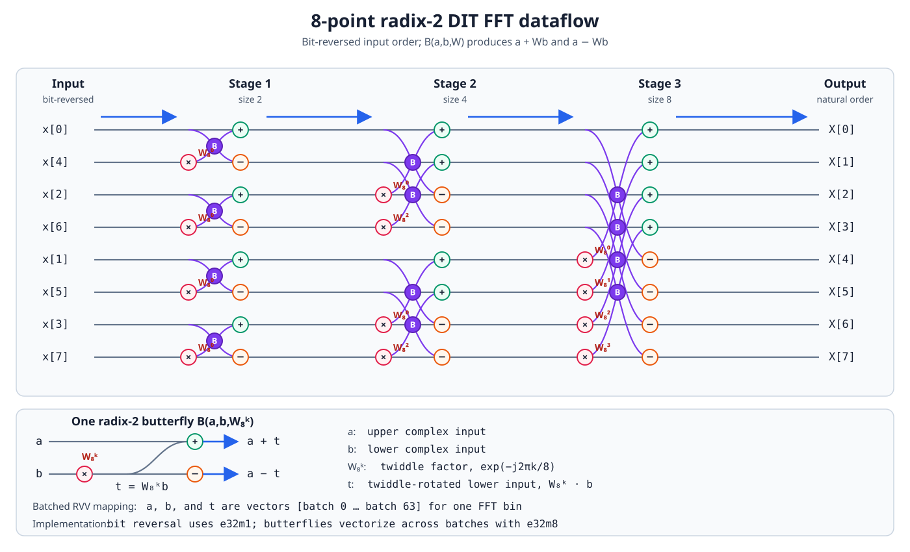

# Batched RVV FFT testbench

This testbench runs 64 independent 1024-point FP32 radix-2 FFTs. Every batch
uses the same input and NumPy ground truth as `testbench/fft`.

## FFT dataflow

The following 8-point radix-2 DIT example shows the same dataflow used by the
1024-point implementation. Input samples are first placed in bit-reversed
order, then processed by $\log_2(8)=3$ butterfly stages. In the batched RVV
implementation, each horizontal wire represents the same FFT bin across all 64
batches, so every butterfly operates on contiguous batch vectors. Red `x`
nodes multiply the lower butterfly input by the labeled twiddle factor, green
`+` nodes form the upper output, and orange `-` nodes form the lower output.
Each purple `B` at a pair of crossing paths marks one complete radix-2
butterfly. The expanded butterfly inset defines $a$ as its upper complex input,
$b$ as its lower complex input, and $t$ as the twiddle-rotated lower input.

For FFT stage $s$, let the block size be $m=2^{s+1}$, the half-block size be
$h=m/2$, the block start be $q$, and the offset inside the half-block be
$k\in[0,h-1]$. If $v_s[n]$ denotes the complex value entering stage $s$, then

$$
\begin{aligned}
a &= v_s[q+k],
&&\text{the upper input of the butterfly}, \\
b &= v_s[q+k+h],
&&\text{the lower input of the butterfly}.
\end{aligned}
$$

Thus, $a$ and $b$ are the two complex values separated by $h$ positions within
the same FFT block. They are not constants. For the 8-point diagram,
$v_0=[x_0,x_4,x_2,x_6,x_1,x_5,x_3,x_7]$ is the bit-reversed input and $v_3$
contains the natural-order FFT outputs $[X_0,\ldots,X_7]$.

The stage-local twiddle factor is

$$
W_m^k = e^{-j 2\pi k/m}.
$$

The diagram expresses every stage using an equivalent power of $W_8$:
$W_m^k=W_8^{8k/m}$.

One butterfly computes

$$
\begin{aligned}
t &= W_m^k b,
&&\text{the twiddle-rotated lower input}, \\
v_{s+1}[q+k] &= a+t,
&&\text{the upper output}, \\
v_{s+1}[q+k+h] &= a-t,
&&\text{the lower output}.
\end{aligned}
$$

In the batched RVV implementation, each scalar-looking symbol is a vector
across the batch dimension:

$$
\mathbf{a}=[a^{(0)},a^{(1)},\ldots,a^{(63)}],\qquad
\mathbf{b}=[b^{(0)},b^{(1)},\ldots,b^{(63)}],\qquad
\mathbf{t}=W_m^k\mathbf{b}.
$$

The twiddle $W_m^k$ is shared by all 64 batches in that butterfly.



## Runtime plan and workspace

The caller supplies the input samples, FFT size $N$, and batch count. At
runtime, `fft_plan_init_f32()` verifies that $N$ is a supported power of two,
computes the stage count, and initializes every stage's twiddle table. For a
stage with half-size $h$, its twiddles start at `h - 1`; consequently all
stage-local tables occupy exactly

$$
1+2+4+\cdots+\frac{N}{2}=N-1
$$

complex entries. Twiddle initialization is measured separately as
`twiddle plan cycles` and is not part of `FFT cycles`. A plan may be reused for
multiple inputs of the same shape without recomputing the table.

The implementation allocates four 64-byte-aligned split-complex workspace
buffers through `nn_runtime.h`:

| Buffer | Runtime elements used | Purpose |
| --- | ---: | --- |
| `fft_data_real` | $N\times B$ | real input and in-place real output |
| `fft_data_imag` | $N\times B$ | imaginary input and in-place imaginary output |
| `fft_twiddle_real` | $N-1$ | real part of every stage's twiddles |
| `fft_twiddle_imag` | $N-1$ | imaginary part of every stage's twiddles |

Every allocation is sized from the runtime $N$ and $B$. Linux/Spike links
`csrc/nn_runtime_linux.c`, while bare-metal links
`baremetal/nn_runtime_baremetal.c`; both runtime allocators return 64-byte-
aligned storage. The plan releases all four buffers through `safe_free()` when
the test completes. Thus allocation occurs once during plan initialization and
never inside the hot loop. Input loading writes every normal-order bin into one
contiguous `[bin][batch]` row. At the start of the FFT region, an explicit
`e32,m1` row swap performs bit reversal. Butterfly stages then use LMUL=m8 with
lanes representing batches, so every vector load/store is unit-stride. This
avoids the high FPGA cost observed for `vsuxei32`.

Cycle reads also go through `nn_runtime_read_cycles()`. Platform selection is
therefore a link-time runtime choice rather than conditional platform code in
the FFT testbench.

Each radix-2 butterfly loads its precomputed scalar twiddle, multiplies the
lower input vector, and computes the upper/lower add-subtract results with
LMUL=m8 vectors. The `offset == 0` case uses
`butterfly_unity_rvv_f32()`, replacing multiplication by $1+0j$ with vector
add/sub operations. Loads, arithmetic results, and stores use separate named
intrinsics rather than nested operands, and the buffer arguments are
`restrict` qualified. This lets the compiler issue independent odd-real,
odd-imaginary, and even-real loads before the dependent multiply/FMA chain;
there are no compiler fences in the butterfly. Bit-reversal swaps use the
FPGA-compatible `e32,m1` sequence; butterfly arithmetic uses `e32,m8`.

The LMUL=m8 butterfly batch dimension uses a VLMAX main loop followed by at
most one tail outside that loop. VL validity is checked once for VLMAX and once
only when a non-empty tail exists. The unity-twiddle decision is also outside
the batch strip-mining loop.

The reported timing regions are:

- `twiddle plan cycles`: one-time plan and twiddle initialization;
- `input layout cycles`: contiguous loading into `[bin][batch]`;
- `FFT cycles`: `e32,m1` bit reversal plus all butterfly stages;
- `reused-plan total cycles`: input layout plus FFT;
- `first-run total cycles`: plan initialization, input layout, and FFT.

Before entering the measured regions, the testbench rejects NaN/Inf inputs and
checks the conservative FP32 component bound

$$
N\max_n\left(\lvert x_{\mathrm{real}}[n]\rvert
             +\lvert x_{\mathrm{imag}}[n]\rvert\right)
\leq \mathrm{FLT\_MAX}, \qquad N=\mathrm{FFT\_SIZE}.
$$

Each output-bin strip-mined loop also rejects a zero VL or a VL larger than the
remaining bin count. Validation counts NaN/Inf outputs explicitly, so
non-finite arithmetic cannot silently
bypass the normal tolerance comparisons. These checks distinguish arithmetic
overflow and invalid VL behavior from finite-but-incorrect hardware results.
Every one of the $64\times1024=65{,}536$ complex outputs is checked. For a
point outside the configured absolute/relative tolerance, the diagnostic
includes its batch and bin indices, actual and expected complex values, and
component errors. To
keep a failing bare-metal run usable over UART, at most the first 64 mismatches
are printed, followed by the total mismatch count and a mismatch count for each
failing batch. Successful batch-0 bins are not dumped, keeping the final
diagnostic summary visible in captured UART logs.

## Build and run

```sh
./scripts/configure_build.sh linux-pk vector fft_batched zvl128b

spike --isa=rv64gcv_zicntr_zihpm_zvbb_zvl128b_zve64d \
    pk build/linux-pk/fft_batched/zvl128b/vector/static/fft_batched
```

Build the bare-metal RVV image:

```sh
make baremetal \
    TESTBENCH=fft_batched \
    BACKEND=vector \
    HARDWARE_CONFIG=V128D128B
```

Flash it to an SD card:

```sh
lsblk

make baremetal-flash \
    TESTBENCH=fft_batched \
    BACKEND=vector \
    HARDWARE_CONFIG=V128D128B \
    SDCARD_DEVICE=/dev/sdX \
    FLASH_CONFIRM=YES
```

Replace `/dev/sdX` with the whole, unmounted SD-card device. The flash target
rejects partitions and mounted devices, then writes the binary beginning at
512-byte block 34. This operation overwrites data on the selected device.

## Performance results

These results apply only to the current four-buffer runtime-plan implementation:
contiguous input layout, `e32,m1` bit-reversal row swaps, LMUL=m8 butterflies,
the current load scheduling, and VLMAX main/tail loops. Older implementations
and measurements are intentionally omitted to avoid comparing different code
versions.

The Spike command for the current implementation is:

```sh
spike --isa=rv64gcv_zicntr_zihpm_zvbb_zvl128b_zve64d \
    pk build/linux-pk/fft_batched/zvl128b/vector/static/fft_batched
```

| Environment | Configuration | FFT size | Batches | Twiddle plan cycles | Input layout cycles | FFT cycles | Reused-plan total cycles | First-run total cycles | FFT cycles/FFT | Reused-plan cycles/FFT | First-run cycles/FFT | Mismatches | Result |
| --- | --- | ---: | ---: | ---: | ---: | ---: | ---: | ---: | ---: | ---: | ---: | ---: | --- |
| Spike simulation | Scalar CPU | 1,024 | 64 | 114,235 | 839,015 | 15,432,206 | 16,271,221 | 16,385,456 | 241,128 | 254,237 | 256,022 | 0 / 65,536 | PASS |
| Spike simulation | `zvl128b`, LMUL=m8, contiguous layout + row swap | 1,024 | 64 | 105,900 | 576,403 | 517,852 | 1,094,255 | 1,200,155 | 8,091 | 17,097 | 18,752 | 0 / 65,536 | PASS |
| Genesys2 FPGA, cold cache | Scalar CPU, 50 MHz | 1,024 | 64 | 171,198 | 759,907 | 12,760,529 | 13,520,436 | 13,691,634 | 199,383 | 211,256 | 213,931 | 0 / 65,536 | PASS |
| Genesys2 FPGA, cold cache | `GENV128D64`, VLEN=128, LMUL=m8 | 1,024 | 64 | 171,159 | 544,211 | 2,129,139 | 2,673,350 | 2,844,509 | 33,267 | 41,771 | 44,445 | 0 / 65,536 | PASS |
| Genesys2 FPGA, cold cache | `GENV128D128`, VLEN=128, LMUL=m8 | 1,024 | 64 | 171,095 | 545,892 | 1,309,551 | 1,855,443 | 2,026,538 | 20,461 | 28,991 | 31,664 | 0 / 65,536 | PASS |
| Genesys2 FPGA, cold cache | `GENV256D64`, VLEN=256, LMUL=m8 | 1,024 | 64 | 171,414 | 543,767 | 2,033,171 | 2,576,938 | 2,748,352 | 31,768 | 40,264 | 42,943 | 0 / 65,536 | PASS |
| Genesys2 FPGA, cold cache | `GENV256D128`, VLEN=256, LMUL=m8 | 1,024 | 64 | 171,275 | 545,437 | 1,175,785 | 1,721,222 | 1,892,497 | 18,371 | 26,894 | 29,570 | 0 / 65,536 | PASS |
| Genesys2 FPGA, cold cache | `GENV512D64`, VLEN=512, LMUL=m8 | 1,024 | 64 | 171,371 | 545,571 | 1,110,281 | 1,655,852 | 1,827,223 | 17,348 | 25,872 | 28,550 | 0 / 65,536 | PASS |
| Genesys2 FPGA, cold cache | `LGVV128D128`, VLEN=128, LMUL=m8 | 1,024 | 64 | 171,119 | 546,616 | 1,276,698 | 1,823,314 | 1,994,433 | 19,948 | 28,489 | 31,163 | 0 / 65,536 | PASS |
| Genesys2 FPGA, cold cache | `LGVV256D128`, VLEN=256, LMUL=m8 | 1,024 | 64 | 171,217 | 545,702 | 1,136,012 | 1,681,714 | 1,852,931 | 17,750 | 26,276 | 28,952 | 0 / 65,536 | PASS |
| Genesys2 FPGA, cold cache | `LGVV512D128`, VLEN=512, LMUL=m8 | 1,024 | 64 | 171,119 | 546,616 | 1,064,237 | 1,610,853 | 1,781,972 | 16,628 | 25,169 | 27,843 | 0 / 65,536 | PASS |

For the RVV rows, the maximum component error was `0.000026`, and the maximum
tolerance ratio was `0.461186`; both occurred at batch 0, bin 1015. The scalar
CPU rows reported maximum component error `0.000024` at batch 0, bin 757 and
maximum tolerance ratio `0.385719` at batch 0, bin 1015. No non-finite outputs
were observed. `First-run total` includes allocation and twiddle initialization,
whereas `reused-plan total` represents another input using an already-created
plan and excludes that row's one-time plan cost.

### Spike speedup over scalar CPU

The scalar and RVV implementations both use normal-order contiguous input
layout and perform bit reversal inside the measured FFT region. Each value is
from one Spike run rather than a multi-run average.

| Compared region | Scalar CPU cycles | RVV cycles | RVV speedup |
| --- | ---: | ---: | ---: |
| FFT kernel | 15,432,206 | 517,852 | 29.80x |
| Reused-plan total | 16,271,221 | 1,094,255 | 14.87x |
| First-run total | 16,385,456 | 1,200,155 | 13.65x |

Both implementations process 64 independent 1024-point FFTs and pass all
65,536 complex-point checks. The kernel comparison excludes plan and input
layout costs; the reused-plan comparison includes input layout; the first-run
comparison additionally includes allocation and twiddle initialization.

### Genesys2 speedup over scalar CPU

The scalar CPU baseline is the matching 50 MHz Genesys2 cold-cache row in the
main table above.

`Max component error` and `Max tolerance ratio` depend on the operator sequence
used by each implementation. Separate multiply/add operations, fused
multiply-add/subtract instructions, unity-twiddle specialization, and a changed
evaluation order can produce different valid FP32 rounding results. These
values therefore describe numerical margin rather than rank implementations by
correctness. The validation result is determined by the number of points whose
tolerance ratio exceeds 1.0, together with the non-finite output count; all
results compared here have zero mismatches and zero non-finite outputs.

For component $c\in\{\mathrm{real},\mathrm{imag}\}$, the reported tolerance
ratio is

$$
r_c = \frac{\lvert y_c-\hat{y}_c\rvert}
           {\mathrm{atol}+\mathrm{rtol}\lvert\hat{y}_c\rvert},
\qquad
r=\max(r_{\mathrm{real}},r_{\mathrm{imag}}).
$$

A complex point is a mismatch when $r>1$.

The speedups in the table are calculated as

$$
S_{\mathrm{kernel}}
=\frac{C_{\mathrm{CPU/FFT}}}{C_{\mathrm{RVV\ kernel/FFT}}},
\qquad
S_{\mathrm{reused}}
=\frac{C_{\mathrm{CPU/FFT}}}{C_{\mathrm{RVV\ reused/FFT}}},
\qquad
S_{\mathrm{first}}
=\frac{C_{\mathrm{CPU/FFT}}}{C_{\mathrm{RVV\ first/FFT}}}.
$$

| RVV configuration | FFT cycles/FFT | Reused cycles/FFT | First-run cycles/FFT | Kernel speedup | Reused-plan speedup | First-run speedup |
| --- | ---: | ---: | ---: | ---: | ---: | ---: |
| `GENV128D64` | 33,267 | 41,771 | 44,445 | 5.99x | 5.06x | 4.81x |
| `GENV128D128` | 20,461 | 28,991 | 31,664 | 9.74x | 7.29x | 6.76x |
| `GENV256D64` | 31,768 | 40,264 | 42,943 | 6.28x | 5.25x | 4.98x |
| `GENV256D128` | 18,371 | 26,894 | 29,570 | 10.85x | 7.86x | 7.23x |
| `GENV512D64` | 17,348 | 25,872 | 28,550 | 11.49x | 8.17x | 7.49x |
| `LGVV128D128` | 19,948 | 28,489 | 31,163 | 9.99x | 7.42x | 6.86x |
| `LGVV256D128` | 17,750 | 26,276 | 28,952 | 11.23x | 8.04x | 7.39x |
| `LGVV512D128` | 16,628 | 25,169 | 27,843 | 11.99x | 8.39x | 7.68x |
